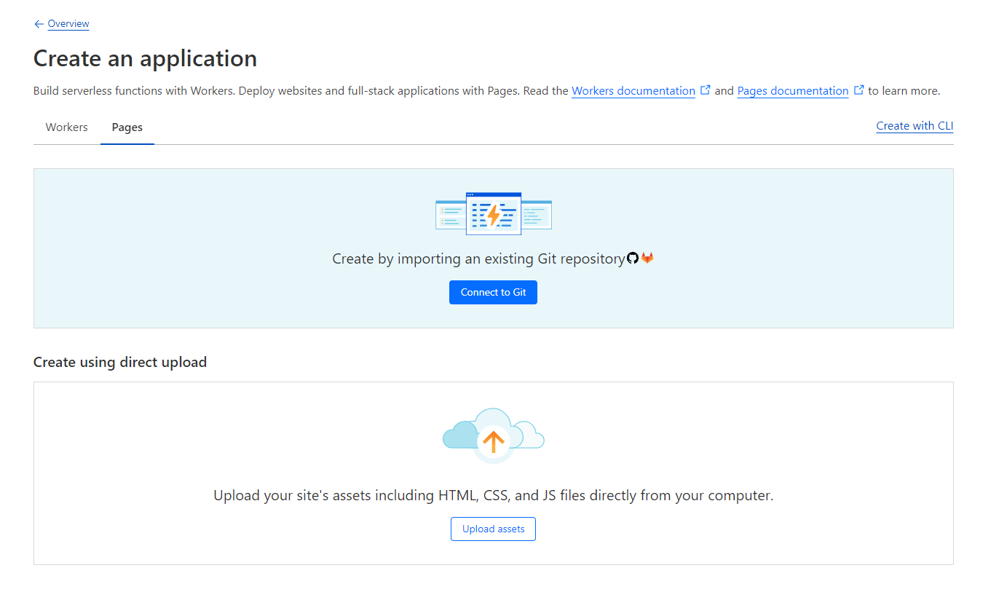

# cloudflare-edge-leaderboard
 A simple leaderboard implementation that can be easily applied to existing projects to report scores

## Step 1: Fork the repo
Use your favorite CLI or Desktop app to fork this repo, and then publish it to GitHub or GitLab (Private or public)

## Step 2: Set up a new CloudFlare Pages Project
Click "Connect to Git" and choose your newly cloned project


### Step 3: Configure .env.template
1. Get your account ID and Global API key from: https://dash.cloudflare.com/profile/api-tokens
2. Update .env.template: 
```
CF_API_KEY=your_cloudflare_api_key
CF_API_EMAIL=your_cloudflare_email
CF_ACCOUNT_ID=your_cloudflare_account_id
CF_API_BASE_URL = "https://api.cloudflare.com/client/v4"
```
3. Rename the file to .env
4. (NOTE!: Add .env to .gitignore, don't expose your CF API key.)

### Step 4: Install dependencies
1. Install NPM dependencies in your project folder with ```npm install``` 
2. Run db_setup.js script with ```node db_setup.js```
3. Run local DB setup with ```# DB Setup npx wrangler d1 execute edge-leaderboard-db --local --command "CREATE TABLE IF NOT EXISTS leaderboard ( name TEXT PRIMARY KEY, score INTEGER, timestamp TEXT);"``` 
4. Run ```npx wrangler pages dev -- npm run dev``` for local development server.

### Step 5: Done! 
Now you can simply push your code for auto-deployments to your CloudFlare Pages project. Any js files you put in /functions will be attempted to be hooked as Worker functions, [read more about CloudFlare Pages Functions here](https://developers.cloudflare.com/pages/functions/)

### (Optional: Wrangler) 
You need to modify your wrangler.tom file if this is not done automatically:
[[d1_databases]]
binding = "DB" # Should match preview_database_id
database_name = "YOUR_DB_NAME_HERE"
database_id = "YOUR_DATABASE_NAME" # wrangler d1 info YOUR_DATABASE_NAME
preview_database_id = "DB" # Required for Pages local development